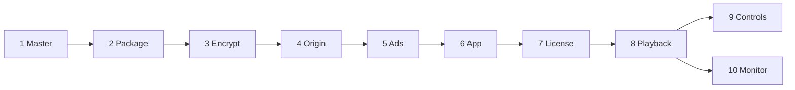

# PlayPath Lab

One title, many devices. The lab follows a single programme from the master file to the screen: package it once, encrypt it once, and play it with the engine each platform already has.

License: MIT

This repository is the proof of that path. **Today:** the documents in [`docs/`](docs/README.md) define the architecture. `./pipeline/master.sh` writes the phase 1 mezzanine ([PP-010](https://github.com/SDS37/playpath-lab/issues/12)). `./pipeline/hls.sh` writes the CMAF ladder and the HLS menu ([PP-020](https://github.com/SDS37/playpath-lab/issues/13)). `./pipeline/dash.sh` writes the DASH menu for those same segments ([PP-021](https://github.com/SDS37/playpath-lab/issues/14)). `./pipeline/timelines.sh` fails if the two menus diverge ([PP-022](https://github.com/SDS37/playpath-lab/issues/15)). `./pipeline/encrypt.sh` writes a CENC copy of that ladder and names the lab key id in both menus ([PP-030](https://github.com/SDS37/playpath-lab/issues/16)). `go run ./services/origin` serves that copy on `http://127.0.0.1:8080` ([PP-040](https://github.com/SDS37/playpath-lab/issues/17)). The same command on `http://127.0.0.1:8081` serves that copy again, and [`services/origin/session.json`](services/origin/session.json) records the second base URL. Playback that continues from that URL after a segment error is not observed yet ([PP-041](https://github.com/SDS37/playpath-lab/issues/18)). `./pipeline/preroll.sh` writes a clear pre-roll of about 5 seconds, and `go run ./services/ads` returns an HLS menu and a DASH MPD on `http://127.0.0.1:8083` that start with that pre-roll and then the film ([PP-050](https://github.com/SDS37/playpath-lab/issues/19)). The same service returns a VAST mid-roll at `http://127.0.0.1:8083/vast/midroll.xml` ([PP-051](https://github.com/SDS37/playpath-lab/issues/20)). The cue is 10 seconds into the film. The clean film menus stay on origin A. [`services/ads/session.json`](services/ads/session.json) names those clean menus for when the stitched URL fails ([PP-052](https://github.com/SDS37/playpath-lab/issues/21)). Playing either break, the fallback, and the impressions, wait for an app. `go run ./services/license` answers a Clear Key request on `http://127.0.0.1:8082` for the lab key id. An unknown key id is a non-success status. `apps/web` plays either protected menu with Shaka on `http://127.0.0.1:5173` after that response. Clear HLS plays through hls.js from `http://127.0.0.1:8084/master.m3u8`. On Safari 26.6.2 the clear menu plays on the media element: the picture is the color bars, and that play does not call the license service. `apps/android` plays the encrypted DASH menu with Media3. The license log shows `POST / 200` and the lab key id, and the Compose screen shows the picture. Back from that screen releases the ExoPlayer instance. A wrong key id is `POST / 403`, a black picture, and a `drm` event with `result: "error"`. Stopping the license service, then playing that menu, is a black picture and the same `drm` error. `apps/ios` plays clear HLS with `AVPlayer`. The simulator shows the picture, and that play does not call the license service. FairPlay is not reported as passing. On Chrome, restricting throughput after hls.js has selected 1080p moves clear HLS to 720p, and the session logs that `bitrate` event. React Native is not built yet. When it exists, the [Definition of Done](docs/DoD.md) is the checklist.

## Current status

| Area | Status |
|---|---|
| Business and technical requirements | Written |
| Architecture, ADRs, engines, happy path | Written |
| Roadmap M0 | Done (docs). M1 stays planned until a rebuilt caption file is shown on every player. M2 stays planned until a player selects the text track. M3 is done. M4 origins A and B exist. M5 stitcher, VAST document, and stitcher fallback choice exist. M6 is done: the web app plays protected DASH and HLS with Shaka, and clear HLS with hls.js. Safari 26.6.2 plays clear HLS on the media element. Android plays encrypted DASH with Media3, including a wrong key id that stays black. iOS plays clear HLS with AVPlayer. FairPlay is not reported as passing. M7 has a web observation: restricting throughput moves clear HLS from 1080p to 720p and the session logs that `bitrate` event. M7 is not done. M8–M10 are not started |
| Code standards (TypeScript, JavaScript, React, React Native, CSS, Kotlin, Swift, Go) | Written |
| Master file | `./pipeline/master.sh` writes `pipeline/master/playpath-bars.mp4` and `.vtt` |
| Packager | `./pipeline/hls.sh` writes the CMAF ladder and `master.m3u8`. `./pipeline/dash.sh` writes `manifest.mpd`. `./pipeline/timelines.sh` fails if the menus diverge |
| Encrypt | `./pipeline/encrypt.sh` writes a CENC copy. The lab key id is in both protected menus. Key bytes stay in `services/license/lab-key.json` |
| Origin | Origin A is `http://127.0.0.1:8080`. Origin B is the same package on `http://127.0.0.1:8081`. The backup base URL is `services/origin/session.json` |
| Ads | `go run ./services/ads` stitches a pre-roll in front of the film on `http://127.0.0.1:8083` and serves the VAST mid-roll. The clean menus stay on origin A. `services/ads/session.json` is the fallback when the stitched URL fails |
| License | `go run ./services/license` answers Clear Key on `http://127.0.0.1:8082` for the lab key id. An unknown id is a non-success status. The web page calls this URL through Shaka. Stopping the service, then playing encrypted DASH on Android, is a black picture and a `drm` error |
| Web player | `apps/web` plays protected DASH and HLS with Shaka, and clear HLS with hls.js, on `http://127.0.0.1:5173`. Play, pause, and seek go through the session. Restricting throughput moves clear HLS from 1080p to 720p and the session logs that `bitrate` event |
| Android, iOS, React Native players | Android plays encrypted DASH with Media3. iOS plays clear HLS with AVPlayer. React Native is not built yet |
| Colleague runbook that plays the title | Not started. It lands with the apps, as the last line of the DoD |

## The path

Phases 1 to 5 finish before any app runs. Phases 6 to 10 are the device.

| Phase | What happens | Technology | Written in |
|---|---|---|---|
| 1 | A mezzanine arrives | Master file | Media workflow |
| 2 | Short segments and two menus | HLS, DASH, one CMAF ladder | C++ packager |
| 3 | Segments are encrypted | MPEG-CENC. Lab key: Clear Key. Production systems need vendor credentials: FairPlay, Widevine, PlayReady. They are not passing | Packager and a Go license service |
| 4 | Files are fetched a few seconds at a time | HTTP, two local origins | Go |
| 5 | A pre-roll is stitched, or a mid-roll is played from VAST | SSAI and CSAI | Go, then the app |
| 6 | The app asks an engine to play a URL | Media3, AVPlayer, Shaka, hls.js | Kotlin, Swift, TypeScript |
| 7 | The engine asks for a key | EME or a native DRM session | Engine and the platform CDM |
| 8 | Buffer, ABR, decode | The engine | Engine and platform decoders |
| 9 | Play, pause, seek | Compose, UIKit, CSS, React Native styles | App languages |
| 10 | The same facts from every device | JSON | Kotlin, Swift, TypeScript |



A stall is fixed in playback. A control that does not match the engine is fixed in the UI. A missing key stays a black screen. A missing ad menu falls back to the clean film.

## Tech stack (target)

| Layer | Technology |
|---|---|
| Master and package | ffmpeg, Shaka Packager or ffmpeg for CMAF, HLS, DASH |
| Encrypt and license | MPEG-CENC, Clear Key (`org.w3.clearkey`) in the PoC |
| Origin and ads | Go |
| Web | TypeScript, React, Shaka Player, hls.js, CSS |
| Android | Kotlin, Jetpack Compose, Media3 ExoPlayer |
| iOS | Swift, UIKit, AVFoundation |
| Shared phone UI | React Native, calling the native engines |
| Monitor | One JSON schema |

## Repository structure

Target layout. Today the repository has `docs/`, `pipeline/`, `services/origin`, `services/ads`, `services/license`, `apps/web`, `apps/android`, and `apps/ios`. React Native is not created yet.

```
playpath-lab/
├── pipeline/                  # phases 1–3
├── services/
│   ├── origin/                # phase 4, ports 8080 and 8081
│   ├── license/               # phase 7, port 8082
│   └── ads/                   # phase 5, port 8083
├── apps/
│   ├── web/                   # React, port 5173
│   ├── android/               # Compose, Media3
│   ├── ios/                   # UIKit, AVPlayer
│   └── mobile/                # React Native
├── packages/
│   └── playback-events/       # phase 10 schema
├── docs/
├── LICENSE
└── README.md
```

## Documentation

- [Documentation index](docs/README.md)
- [Business requirements](docs/business-requirements.md)
- [Technical requirements](docs/technical-requirements.md)
- [Happy path](docs/happy-path.md)
- [Architecture](docs/architecture.md)
- [Engines](docs/engines.md)
- [Roadmap](docs/roadmap.md)
- [Definition of Done](docs/DoD.md)
- [Beyond the PoC](docs/beyond-poc.md)
- [Architecture decision records](docs/architecture-decision-records.md)
- [Playback events](docs/playback-events.md)
- [Controls and UX](docs/ux-controls.md)
- [Commits](docs/commits.md)
- Standards: [TypeScript](docs/standards/typescript.md), [JavaScript](docs/standards/javascript.md), [React](docs/standards/react.md), [React Native](docs/standards/react-native.md), [CSS](docs/standards/css.md), [Kotlin](docs/standards/kotlin.md), [Swift](docs/standards/swift.md), [Go](docs/standards/go.md), [dependencies we do not author](docs/standards/dependencies.md)

## How to read this

Start with the [happy path](docs/happy-path.md) if you want the demo in order. Start with [architecture](docs/architecture.md) if you want each phase and the language that owns it. Standards apply once a milestone in the [roadmap](docs/roadmap.md) creates that code.

## Generate the master

Requires `ffmpeg` and `ffprobe` on `PATH`, with libx264 and the native AAC encoder. From the repository root:

```bash
./pipeline/master.sh
```

That writes `pipeline/master/playpath-bars.mp4` (60 seconds, 1920×1080 H.264, closed GOP, stereo AAC-LC) and `pipeline/master/playpath-bars.vtt`. The mp4 is the mezzanine, the intermediate other encodes are made from. The `.vtt` is a sidecar: captions in a companion file, not burned into the picture. The tiers are defined in [Phase 1 of the architecture](docs/architecture.md#phase-1--master). Those files are build products and are not committed. Pass a WebVTT path to use that caption file instead of the default cues. The directory stays free of `.m3u8` and `.mpd` files.

## Package HLS

Requires the mezzanine from `./pipeline/master.sh`, plus `ffmpeg` and `ffprobe` on `PATH`. From the repository root:

```bash
./pipeline/hls.sh
```

That writes `pipeline/package/playpath-bars/`: two H.264 video rungs (1280×720 and 1920×1080), one stereo AAC-LC rendition, and the WebVTT captions, as fragmented MP4 with an HLS multivariant playlist. Segment duration is 6 seconds, the duration in the [HLS Authoring Specification for Apple Devices](https://developer.apple.com/documentation/http-live-streaming/hls-authoring-specification-for-apple-devices) (items 7.5 and 7.6), recorded in [`pipeline/timeline`](pipeline/timeline). Those files are build products and are not committed. The master directory stays free of playlists.

## Package DASH

Requires the ladder from `./pipeline/hls.sh`. From the repository root:

```bash
./pipeline/dash.sh
```

That writes `pipeline/package/playpath-bars/manifest.mpd`. The MPD lists the same two video rungs, the audio rendition, and the WebVTT sidecar. Segment times come from the CMAF segments already on disk. The command does not encode a second ladder. It then runs `./pipeline/timelines.sh`.

## Check the timelines

Requires both menus. From the repository root:

```bash
./pipeline/timelines.sh
```

That compares each HLS media-playlist segment with the matching DASH segment, and compares the presentation duration. The command exits with an error when the menus diverge.

## Encrypt

Requires the ladder from `./pipeline/hls.sh` and `./pipeline/dash.sh`, plus `ffmpeg` and `python3` on `PATH`. macOS uses CommonCrypto for AES-CTR. Any other system also needs `openssl` on `PATH`. From the repository root:

```bash
./pipeline/encrypt.sh
```

That reads the published lab test key in [`services/license/lab-key.json`](services/license/lab-key.json) and writes `pipeline/protected/playpath-bars/`. A failed encryption or timeline check removes the temporary copy and leaves an existing protected tree in place. The copy is the same CMAF timeline with MPEG-CENC sample encryption. Both menus name the key id and the Clear Key system `org.w3.clearkey`. The key bytes stay in that config. The clear package is left in place for clear HLS. Captions stay in the clear. Those protected files are build products and are not committed. FairPlay, Widevine, and PlayReady need vendor credentials and are not reported as passing. See [beyond the PoC](docs/beyond-poc.md).

## Origin

Requires the protected package from `./pipeline/encrypt.sh`, and Go on `PATH`. From the repository root:

```bash
go run ./services/origin
```

That listens on `http://127.0.0.1:8080` and serves `pipeline/protected/playpath-bars/`. Origin B is a second process:

```bash
go run ./services/origin -addr 127.0.0.1:8081
```

Both serve the same files. `GET` and `HEAD` of a menu or segment return a content type and `Last-Modified`. `.m3u8` is `application/vnd.apple.mpegurl` and `.mpd` is `application/dash+xml`. Video fMP4 is `video/mp4`. fMP4 in the `audio` rendition is `audio/mp4`. The process does not list directories and does not serve the content key. A page on exactly `http://127.0.0.1:5173` can read menus and segments. Any other origin gets no `Access-Control-Allow-Origin`. Every response sends `Vary: Origin`. [`services/origin/session.json`](services/origin/session.json) names `http://127.0.0.1:8081` as the backup base URL. `-refuse-segments` makes that process answer 503 for a media segment (`.m4s`) and leave the menus up. The same path on the other origin still returns the segment. An engine that continues playback from there is not built yet.

## Ads

Requires the protected package from `./pipeline/encrypt.sh`, the pre-roll from `./pipeline/preroll.sh`, and Go on `PATH`. From the repository root:

```bash
./pipeline/preroll.sh
go run ./services/ads
```

That listens on `http://127.0.0.1:8083` when the pre-roll renditions, init segments, creative, and caption are regular files. `GET /ssai/hls/master.m3u8` and `GET /ssai/dash/manifest.mpd` start with a clear pre-roll of about 5 seconds and then the film. Film segment URLs point at `http://127.0.0.1:8080`. The clean film menus stay on that origin: `/master.m3u8` and `/manifest.mpd`. This service does not serve those paths, or `duration.txt`, and does not redirect to them. [`services/ads/session.json`](services/ads/session.json) names the clean menu for a stitched URL that failed. That choice does not request an impression. `GET /vast/midroll.xml` is one VAST linear creative, an impression URL, and a cue at 10 seconds. The creative is `creative.mp4` from `./pipeline/preroll.sh`, a clear progressive file, not the film. Playing the stitched URL, playing that creative and returning to the cued second, playing the clean film after the stitcher stops, and the `ad` impressions, wait for an app.

## Clear Key license

Requires Go on `PATH`. From the repository root:

```bash
go run ./services/license
```

That listens on `http://127.0.0.1:8082`. `POST /` with the lab key id returns a Clear Key JSON Web Key set. The id may be the hex form in the protected menus or the base64url form a CDM sends. An unknown key id gets a non-success status. The response does not redirect to the clear package, and the log records the key id rather than the key. A page on `http://127.0.0.1:5173` can read the response. The web app calls this URL through Shaka. The Android app calls it through a Media3 DRM session. A wrong key id on that app stays a black picture and a `drm` error. Stopping the service, then playing encrypted DASH, is the same black picture and `drm` error. The clear package is not requested.

## Play on the web

Requires the protected package, origin A, the license service, and Node 20.19 or newer. From `apps/web`:

```bash
npm install
npm run dev
```

Open `http://127.0.0.1:5173`. `localhost` is a different origin, and origin A, the clear package, and the license service allow only that host. The page loads `http://127.0.0.1:8080/manifest.mpd` or `http://127.0.0.1:8080/master.m3u8` through Shaka. Play reaches a picture after a Clear Key response from `http://127.0.0.1:8082/`. Clear HLS is `http://127.0.0.1:8084/master.m3u8`, from `go run ./services/origin -addr 127.0.0.1:8084 -dir pipeline/package/playpath-bars`. Where hls.js is supported, that menu plays through it and does not call the license service. The page does not contain the content key. Play, pause, and seek go through the session, and the controls do not import Shaka or hls.js. Ads playback and origin-B failover are not this page. See [`apps/web/README.md`](apps/web/README.md).

## Play on Android

Requires the protected package, origin A, the license service, a JDK, and an Android SDK. From `apps/android`:

```bash
./wrong-kid.sh
./gradlew assembleDebug
```

`adb reverse tcp:8080 tcp:8080` and `adb reverse tcp:8082 tcp:8082` make the emulator’s `127.0.0.1` the host, which is what the menu and the license URL already say. Install the debug APK and open it. DASH plays after `POST / 200`. Wrong key stays black after `POST / 403`. The content key is not in the app. See [`apps/android/README.md`](apps/android/README.md).

## Play on iOS

Requires the clear package and an iOS simulator. From `apps/ios`:

```bash
xcodebuild -project Playpath.xcodeproj -scheme Playpath -sdk iphonesimulator -configuration Debug -derivedDataPath build build
```

The simulator uses the host’s `127.0.0.1`, so `http://127.0.0.1:8084/master.m3u8` needs no port reverse. The picture appears in UIKit. The license log does not show a request from that play. FairPlay needs an FPS certificate and `AVContentKeySession`, and this app does not report that as passing. See [`apps/ios/README.md`](apps/ios/README.md).

## Commit convention

[Conventional Commits](https://www.conventionalcommits.org/en/v1.0.0/): `type(scope): message`. Details and scopes: [docs/commits.md](docs/commits.md).

```
feat(pipeline): write HLS and DASH menus from the mezzanine
docs: add the PoC architecture
```

## License

MIT. See [LICENSE](LICENSE).
