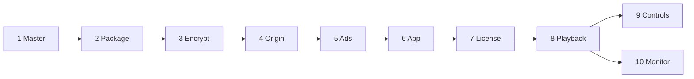

# PlayPath Lab

One title, many devices. The lab follows a single programme from the master file to the screen: package it once, encrypt it once, and play it with the engine each platform already has.

License: MIT

This repository is the proof of that path. **Today:** the documents in [`docs/`](docs/README.md) define the architecture. `./pipeline/master.sh` writes the phase 1 mezzanine ([PP-010](https://github.com/SDS37/playpath-lab/issues/12)). `./pipeline/hls.sh` writes the CMAF ladder and the HLS menu ([PP-020](https://github.com/SDS37/playpath-lab/issues/13)). `./pipeline/dash.sh` writes the DASH menu for those same segments ([PP-021](https://github.com/SDS37/playpath-lab/issues/14)). `./pipeline/timelines.sh` fails if the two menus diverge ([PP-022](https://github.com/SDS37/playpath-lab/issues/15)). `./pipeline/encrypt.sh` writes a CENC copy of that ladder and names the lab key id in both menus ([PP-030](https://github.com/SDS37/playpath-lab/issues/16)). `go run ./services/origin` serves that copy on `http://127.0.0.1:8080` ([PP-040](https://github.com/SDS37/playpath-lab/issues/17)). The same command on `http://127.0.0.1:8081` is origin B, and [`services/origin/session.json`](services/origin/session.json) names that backup base URL ([PP-041](https://github.com/SDS37/playpath-lab/issues/18)). The license service and the apps are not built yet. When they exist, the [Definition of Done](docs/DoD.md) is the checklist.

## Current status

| Area | Status |
|---|---|
| Business and technical requirements | Written |
| Architecture, ADRs, engines, happy path | Written |
| Roadmap M0 | Done (docs). M1 and M2 package commands exist. M3 encrypt command exists. M4 origins A and B exist. M5–M10 are not started |
| Code standards (TypeScript, JavaScript, React, React Native, CSS, Kotlin, Swift, Go) | Written |
| Master file | `./pipeline/master.sh` writes `pipeline/master/playpath-bars.mp4` and `.vtt` |
| Packager | `./pipeline/hls.sh` writes the CMAF ladder and `master.m3u8`. `./pipeline/dash.sh` writes `manifest.mpd`. `./pipeline/timelines.sh` fails if the menus diverge |
| Encrypt | `./pipeline/encrypt.sh` writes a CENC copy. The lab key id is in both protected menus. Key bytes stay in `services/license/lab-key.json` |
| Origin | Origin A is `http://127.0.0.1:8080`. Origin B is the same package on `http://127.0.0.1:8081`. The backup base URL is `services/origin/session.json` |
| License, ads | Not started. The license config file exists. The service does not |
| Web, Android, iOS, React Native players | Not started |
| Colleague runbook that plays the title | Not started. It lands with the apps, as the last line of the DoD |

## The path

Phases 1 to 5 finish before any app runs. Phases 6 to 10 are the device.

| Phase | What happens | Technology | Written in |
|---|---|---|---|
| 1 | A mezzanine arrives | Master file | Media workflow |
| 2 | Short segments and two menus | HLS, DASH, one CMAF ladder | C++ packager |
| 3 | Segments are encrypted | MPEG-CENC. Lab key: Clear Key. Production systems need vendor credentials: FairPlay, Widevine, PlayReady. They are not passing | Packager and a Go license service |
| 4 | Files are fetched a few seconds at a time | HTTP, two local origins | Go |
| 5 | A pre-roll is stitched, or a mid-roll is played from VAST | SSAI and CSAI | Go, then the app |
| 6 | The app asks an engine to play a URL | Media3, AVPlayer, Shaka, hls.js | Kotlin, Swift, TypeScript |
| 7 | The engine asks for a key | EME or a native DRM session | Engine and the platform CDM |
| 8 | Buffer, ABR, decode | The engine | Engine and platform decoders |
| 9 | Play, pause, seek | Compose, UIKit, CSS, React Native styles | App languages |
| 10 | The same facts from every device | JSON | Kotlin, Swift, TypeScript |



A stall is fixed in playback. A control that does not match the engine is fixed in the UI. A missing key stays a black screen. A missing ad menu falls back to the clean film.

## Tech stack (target)

| Layer | Technology |
|---|---|
| Master and package | ffmpeg, Shaka Packager or ffmpeg for CMAF, HLS, DASH |
| Encrypt and license | MPEG-CENC, Clear Key (`org.w3.clearkey`) in the PoC |
| Origin and ads | Go |
| Web | TypeScript, React, Shaka Player, hls.js, CSS |
| Android | Kotlin, Jetpack Compose, Media3 ExoPlayer |
| iOS | Swift, UIKit, AVFoundation |
| Shared phone UI | React Native, calling the native engines |
| Monitor | One JSON schema |

## Repository structure

Target layout. Today the repository has `docs/`, `pipeline/`, `services/origin`, and `services/license/lab-key.json`. The license service, the ads service, and the apps are not created yet.

```
playpath-lab/
├── pipeline/                  # phases 1–3
├── services/
│   ├── origin/                # phase 4, ports 8080 and 8081
│   ├── license/               # phase 7, port 8082
│   └── ads/                   # phase 5, port 8083
├── apps/
│   ├── web/                   # React, port 5173
│   ├── android/               # Compose, Media3
│   ├── ios/                   # UIKit, AVPlayer
│   └── mobile/                # React Native
├── packages/
│   └── playback-events/       # phase 10 schema
├── docs/
├── LICENSE
└── README.md
```

## Documentation

- [Documentation index](docs/README.md)
- [Business requirements](docs/business-requirements.md)
- [Technical requirements](docs/technical-requirements.md)
- [Happy path](docs/happy-path.md)
- [Architecture](docs/architecture.md)
- [Engines](docs/engines.md)
- [Roadmap](docs/roadmap.md)
- [Definition of Done](docs/DoD.md)
- [Beyond the PoC](docs/beyond-poc.md)
- [Architecture decision records](docs/architecture-decision-records.md)
- [Playback events](docs/playback-events.md)
- [Controls and UX](docs/ux-controls.md)
- [Commits](docs/commits.md)
- Standards: [TypeScript](docs/standards/typescript.md), [JavaScript](docs/standards/javascript.md), [React](docs/standards/react.md), [React Native](docs/standards/react-native.md), [CSS](docs/standards/css.md), [Kotlin](docs/standards/kotlin.md), [Swift](docs/standards/swift.md), [Go](docs/standards/go.md), [dependencies we do not author](docs/standards/dependencies.md)

## How to read this

Start with the [happy path](docs/happy-path.md) if you want the demo in order. Start with [architecture](docs/architecture.md) if you want each phase and the language that owns it. Standards apply once a milestone in the [roadmap](docs/roadmap.md) creates that code.

## Generate the master

Requires `ffmpeg` and `ffprobe` on `PATH`, with libx264 and the native AAC encoder. From the repository root:

```bash
./pipeline/master.sh
```

That writes `pipeline/master/playpath-bars.mp4` (60 seconds, 1920×1080 H.264, closed GOP, stereo AAC-LC) and `pipeline/master/playpath-bars.vtt`. The mp4 is the mezzanine, the intermediate other encodes are made from. The `.vtt` is a sidecar: captions in a companion file, not burned into the picture. The tiers are defined in [Phase 1 of the architecture](docs/architecture.md#phase-1--master). Those files are build products and are not committed. Pass a WebVTT path to use that caption file instead of the default cues. The directory stays free of `.m3u8` and `.mpd` files.

There is no player on port 5173 yet.

## Package HLS

Requires the mezzanine from `./pipeline/master.sh`, plus `ffmpeg` and `ffprobe` on `PATH`. From the repository root:

```bash
./pipeline/hls.sh
```

That writes `pipeline/package/playpath-bars/`: two H.264 video rungs (1280×720 and 1920×1080), one stereo AAC-LC rendition, and the WebVTT captions, as fragmented MP4 with an HLS multivariant playlist. Segment duration is 6 seconds, the duration in the [HLS Authoring Specification for Apple Devices](https://developer.apple.com/documentation/http-live-streaming/hls-authoring-specification-for-apple-devices) (items 7.5 and 7.6), recorded in [`pipeline/timeline`](pipeline/timeline). Those files are build products and are not committed. The master directory stays free of playlists.

## Package DASH

Requires the ladder from `./pipeline/hls.sh`. From the repository root:

```bash
./pipeline/dash.sh
```

That writes `pipeline/package/playpath-bars/manifest.mpd`. The MPD lists the same two video rungs, the audio rendition, and the WebVTT sidecar. Segment times come from the CMAF segments already on disk. The command does not encode a second ladder. It then runs `./pipeline/timelines.sh`.

## Check the timelines

Requires both menus. From the repository root:

```bash
./pipeline/timelines.sh
```

That compares each HLS media-playlist segment with the matching DASH segment, and compares the presentation duration. The command exits with an error when the menus diverge.

## Encrypt

Requires the ladder from `./pipeline/hls.sh` and `./pipeline/dash.sh`, plus `ffmpeg` and `python3` on `PATH`. macOS uses CommonCrypto for AES-CTR. Any other system also needs `openssl` on `PATH`. From the repository root:

```bash
./pipeline/encrypt.sh
```

That reads the published lab test key in [`services/license/lab-key.json`](services/license/lab-key.json) and writes `pipeline/protected/playpath-bars/`. The copy is the same CMAF timeline with MPEG-CENC sample encryption. Both menus name the key id and the Clear Key system `org.w3.clearkey`. The key bytes stay in that config. The clear package is left in place for clear HLS. Captions stay in the clear. Those protected files are build products and are not committed. FairPlay, Widevine, and PlayReady need vendor credentials and are not reported as passing. See [beyond the PoC](docs/beyond-poc.md).

## Origin

Requires the protected package from `./pipeline/encrypt.sh`, and Go on `PATH`. From the repository root:

```bash
go run ./services/origin
```

That listens on `http://127.0.0.1:8080` and serves `pipeline/protected/playpath-bars/`. Origin B is a second process:

```bash
go run ./services/origin -addr 127.0.0.1:8081
```

Both serve the same files. `GET` and `HEAD` of a menu or segment return a content type and `Last-Modified`. `.m3u8` is `application/vnd.apple.mpegurl` and `.mpd` is `application/dash+xml`. Video fMP4 is `video/mp4`. fMP4 in the `audio` rendition is `audio/mp4`. The process does not list directories and does not serve the content key. [`services/origin/session.json`](services/origin/session.json) names `http://127.0.0.1:8081` as the backup base URL. `-refuse-segments` makes that process answer 503 for a media segment (`.m4s`) and leave the menus up. The same path on the other origin still returns the segment. An engine that continues playback from there is not built yet.

## Commit convention

[Conventional Commits](https://www.conventionalcommits.org/en/v1.0.0/): `type(scope): message`. Details and scopes: [docs/commits.md](docs/commits.md).

```
feat(pipeline): write HLS and DASH menus from the mezzanine
docs: add the PoC architecture
```

## License

MIT. See [LICENSE](LICENSE).
