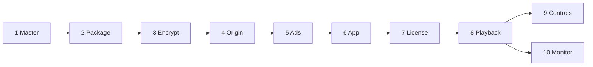

# PlayPath Lab

One title, many devices. The lab follows a single programme from the master file to the screen: package it once, encrypt it once, and play it with the engine each platform already has.

License: MIT

This repository is the proof of that path. **Today:** the documents in [`docs/`](docs/README.md) define the architecture, the requirements, the standards, and the demo. The pipeline, the local services, and the apps are not built yet. When they exist, the [Definition of Done](docs/DoD.md) is the checklist.

## Current status

| Area | Status |
|---|---|
| Business and technical requirements | Written |
| Architecture, ADRs, engines, happy path | Written |
| Roadmap M0 | Done (docs). M1–M10 not started |
| Code standards (TypeScript, JavaScript, React, React Native, CSS, Kotlin, Swift, Go) | Written |
| Master file, packager, origin, license, ads | Not started |
| Web, Android, iOS, React Native players | Not started |
| Colleague runbook that plays the title | Not started. It lands with the apps, as the last line of the DoD |

## The path

Phases 1 to 5 finish before any app runs. Phases 6 to 10 are the device.

| Phase | What happens | Technology | Written in |
|---|---|---|---|
| 1 | A mezzanine arrives | Master file | Media workflow |
| 2 | Short segments and two menus | HLS, DASH, one CMAF ladder | C++ packager |
| 3 | Segments are encrypted | MPEG-CENC. Lab key: Clear Key. Production: FairPlay, Widevine, PlayReady | Packager and a Go license service |
| 4 | Files are fetched a few seconds at a time | HTTP, two local origins | Go |
| 5 | A pre-roll is stitched, or a mid-roll is played from VAST | SSAI and CSAI | Go, then the app |
| 6 | The app asks an engine to play a URL | Media3, AVPlayer, Shaka, hls.js | Kotlin, Swift, TypeScript |
| 7 | The engine asks for a key | EME or a native DRM session | Engine and the platform CDM |
| 8 | Buffer, ABR, decode | The engine | Engine and platform decoders |
| 9 | Play, pause, seek | Compose, UIKit, CSS, React Native styles | App languages |
| 10 | The same facts from every device | JSON | Kotlin, Swift, TypeScript |



A stall is fixed in playback. A control that does not match the engine is fixed in the UI. A missing key stays a black screen. A missing ad menu falls back to the clean film.

## Tech stack (target)

| Layer | Technology |
|---|---|
| Master and package | ffmpeg, Shaka Packager or ffmpeg for CMAF, HLS, DASH |
| Encrypt and license | MPEG-CENC, Clear Key (`org.w3.clearkey`) in the PoC |
| Origin and ads | Go |
| Web | TypeScript, React, Shaka Player, hls.js, CSS |
| Android | Kotlin, Jetpack Compose, Media3 ExoPlayer |
| iOS | Swift, UIKit, AVFoundation |
| Shared phone UI | React Native, calling the native engines |
| Monitor | One JSON schema |

## Repository structure

Target layout. Only `docs/`, `README.md`, and `LICENSE` exist today.

```
playpath-lab/
├── pipeline/                  # phases 1–3
├── services/
│   ├── origin/                # phase 4, ports 8080 and 8081
│   ├── license/               # phase 7, port 8082
│   └── ads/                   # phase 5, port 8083
├── apps/
│   ├── web/                   # React, port 5173
│   ├── android/               # Compose, Media3
│   ├── ios/                   # UIKit, AVPlayer
│   └── mobile/                # React Native
├── packages/
│   └── playback-events/       # phase 10 schema
├── docs/
├── LICENSE
└── README.md
```

## Documentation

- [Documentation index](docs/README.md)
- [Business requirements](docs/business-requirements.md)
- [Technical requirements](docs/technical-requirements.md)
- [Happy path](docs/happy-path.md)
- [Architecture](docs/architecture.md)
- [Engines](docs/engines.md)
- [Roadmap](docs/roadmap.md)
- [Definition of Done](docs/DoD.md)
- [Beyond the PoC](docs/beyond-poc.md)
- [Architecture decision records](docs/architecture-decision-records.md)
- [Playback events](docs/playback-events.md)
- [Controls and UX](docs/ux-controls.md)
- [Commits](docs/commits.md)
- Standards: [TypeScript](docs/standards/typescript.md), [JavaScript](docs/standards/javascript.md), [React](docs/standards/react.md), [React Native](docs/standards/react-native.md), [CSS](docs/standards/css.md), [Kotlin](docs/standards/kotlin.md), [Swift](docs/standards/swift.md), [Go](docs/standards/go.md), [dependencies we do not author](docs/standards/dependencies.md)

## How to read this

Start with the [happy path](docs/happy-path.md) if you want the demo in order. Start with [architecture](docs/architecture.md) if you want each phase and the language that owns it. Standards apply once a milestone in the [roadmap](docs/roadmap.md) creates that code.

There is no install step yet. When M1 lands, this README gains the commands. Until then, do not expect a player on port 5173.

## Commit convention

[Conventional Commits](https://www.conventionalcommits.org/en/v1.0.0/): `type(scope): message`. Details and scopes: [docs/commits.md](docs/commits.md).

```
feat(pipeline): write HLS and DASH menus from the mezzanine
docs: add the PoC architecture
```

## License

MIT. See [LICENSE](LICENSE).
