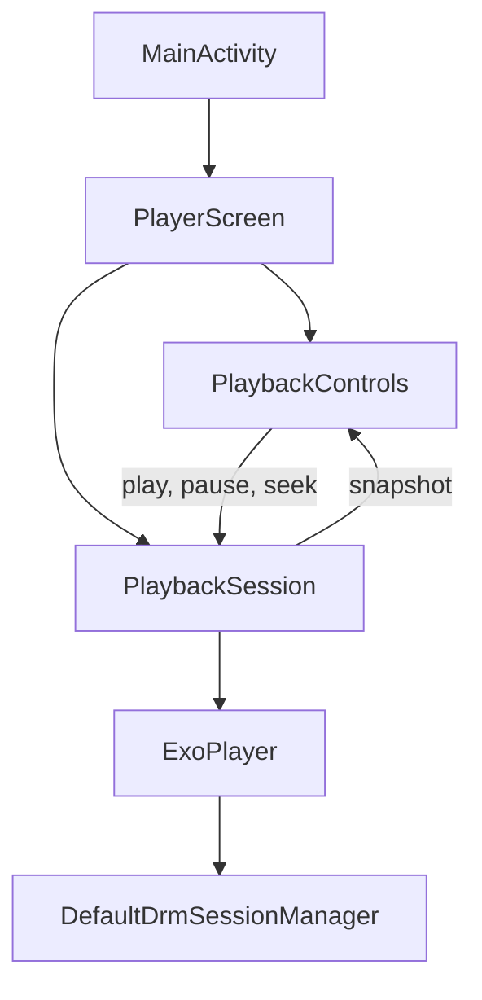

# Android

The Android app plays protected `playpath-bars` with [Media3 ExoPlayer](https://github.com/androidx/media) 1.11.1. It is the encrypted DASH session. The web app and iOS are other apps.

Requires origin A, the license service, a JDK, and the Android SDK. From `apps/android`, after `./pipeline/encrypt.sh` has written the protected package:

```bash
./wrong-kid.sh
./gradlew assembleDebug
```

`wrong-kid.sh` copies the protected menu and its init segments, and changes only the key id. The segments stay encrypted with the lab key. The content key is not read. The copy is a build product under `pipeline/protected/` and is not committed.

Point the emulator at the host before opening the app. The menu and the license URL are already `127.0.0.1`, and inside the emulator that address is the emulator itself.

```bash
adb reverse tcp:8080 tcp:8080
adb reverse tcp:8082 tcp:8082
adb reverse tcp:8083 tcp:8083
adb install -r app/build/outputs/apk/debug/app-debug.apk
adb shell am start -n lab.playpath.player/.MainActivity
```

DASH loads `http://127.0.0.1:8080/manifest.mpd`. `PlaybackSession` builds an `ExoPlayer`, sets that DASH `MediaItem`, and opens a `DefaultDrmSessionManager` for `org.w3.clearkey` at `http://127.0.0.1:8082/`. The license log shows `POST / 200` and the lab key id. The Compose screen shows the picture. Play, pause, and seek go through the session. At 10 seconds the session plays the VAST creative, seek is disabled, and a drag leaves the creative in place. The film then continues from that cue and seek is enabled. Stitched loads `http://127.0.0.1:8083/ssai/dash/manifest.mpd`. On the emulator the picture is the green pre-roll, then the color bars, and the label reaches 0:32 / 1:05. Logcat tag `playpath.event` logs `startup` when playback starts, an `ad` impression with `breakId` `preroll` and `mode` `ssai`, and `ad` when the mid-roll starts and ends, including an impression with `breakId` `midroll` and `mode` `csai`. The impression URL is not requested. Play after the title ends seeks to the start. Play after an error, and choosing the menu that is already selected, loads that menu again. The session does not choose a rung. When origin A returns 503 for a `.m4s`, the media data source opens that same path on `http://127.0.0.1:8081`. The license callback stays on `http://127.0.0.1:8082/`. On the emulator, with `-refuse-segments` and `adb reverse` for 8081, protected DASH reached 0:50 and `720p/seg_0.m4s` was 503 on origin A and 200 on origin B. `onTracksChanged` logs `bitrate` with the selected video height and bandwidth. A step down on the emulator is still open. The stock `PlayerView` bar is off. Stopping the activity pauses playback. Back from the Compose screen leaves the activity. Logcat then shows `ExoPlayerImpl: Release` for the same instance that logged `Init`, and the launcher is in front. Audio had been playing.

Wrong key loads `http://127.0.0.1:8080/manifest-wrong-kid.mpd`. The license log shows `POST / 403` and the other key id, and it does not log the key. The picture stays black. The screen says the title cannot be played. Logcat tag `playpath.event` contains one JSON object per DRM result, including `event: "drm"`, `result: "error"`, and `code: "ERROR_CODE_DRM_LICENSE_ACQUISITION_FAILED"`. The app does not load the clear package. Stopping the license service, then opening DASH, is a black picture and the same `drm` error with `code: "ERROR_CODE_DRM_LICENSE_ACQUISITION_FAILED"`. The clear package is not requested.

## Screen

`MainActivity` sets `PlaypathTheme` and `PlayerScreen`. `PlayerScreen` keeps the selected menu and the session. `PlaybackControls` draws Pause while the engine is playing or seeking, and Play while it is paused or ended. Seek stays visible and is disabled while the mid-roll plays. The time label reads Ad during that creative. Color, type, and spacing come from `PlaypathTheme`. A DRM error uses the same Play label and the sentence “The title cannot be played.”



`PlaybackSession` is the only type that talks to Media3. Controls do not import it, read a playlist, or receive key bytes.
