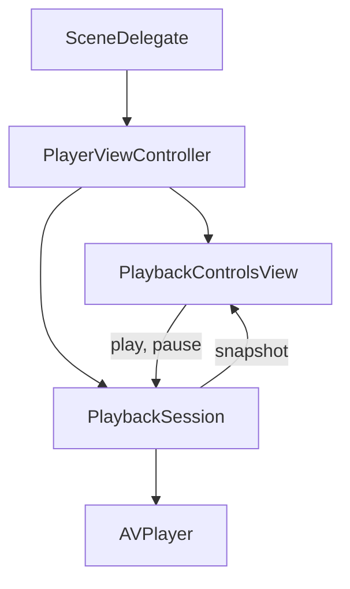

# iOS

The iOS app plays clear `playpath-bars` with [AVPlayer](https://developer.apple.com/documentation/avfoundation/avplayer). The menu is `http://127.0.0.1:8084/master.m3u8`, from the origin pointed at `pipeline/package/playpath-bars`. This PoC plays that clear HLS menu. It does not call the license service.

FairPlay needs an FPS certificate and a key server module, and it needs an [`AVContentKeySession`](https://developer.apple.com/documentation/avfoundation/avcontentkeysession) on the asset. Those credentials are not in this PoC. The app does not create that session and does not report a FairPlay result. See [beyond the PoC](../../docs/beyond-poc.md).

Requires the clear package and an iOS simulator. From `apps/ios`:

```bash
xcodebuild -project Playpath.xcodeproj -scheme Playpath -sdk iphonesimulator -configuration Debug -derivedDataPath build build
```

The simulator shares the host’s `127.0.0.1`, so the menu URL does not need a port reverse. Install `build/Build/Products/Debug-iphonesimulator/Playpath.app` and open it. On an iOS 27 simulator the screen shows the color bars and Pause while the picture changes. The license log does not record a request from that play.

`PlaybackSession` creates an `AVPlayer` for that URL, observes `timeControlStatus`, the item status, and the access log. The picture is an `AVPlayerLayer`. Play and pause go through the session. The session does not choose a rung. The system transport bar is off. Entering the background pauses playback.

## Screen

`SceneDelegate` shows `PlayerViewController`. That controller keeps the session and `PlaybackControlsView`. The controls draw Pause while the engine is playing or seeking, and Play while it is paused or ended. A failed item says “Playback failed.”



`PlaybackSession` is the only type that talks to AVFoundation for playback policy. Controls do not import it, read a playlist, or receive key bytes.
