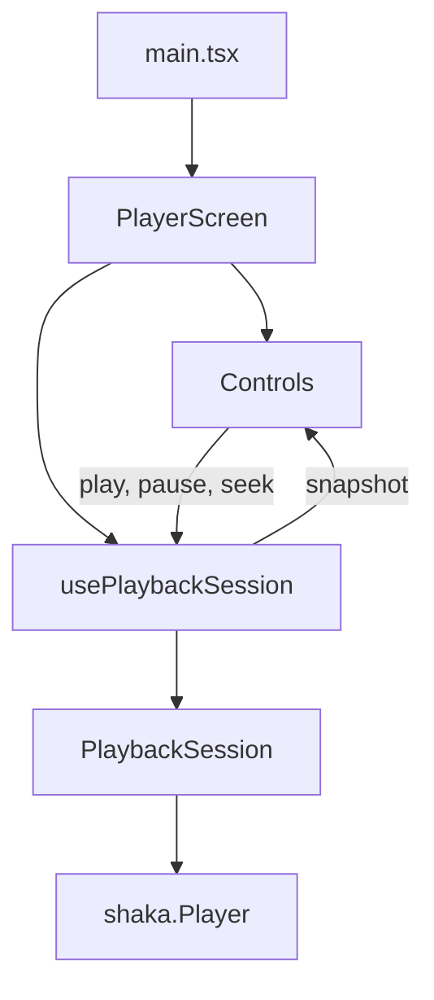

# Web

The web app plays protected `playpath-bars` with [Shaka Player](https://github.com/shaka-project/shaka-player). It is the encrypted DASH and HLS session for Chrome, Edge, and Firefox. hls.js is a later clear-HLS build. Android and iOS are other apps.

Requires origin A, the license service, and Node 20.19 or newer. From `apps/web`:

```bash
npm install
npm run dev
```

Open `http://127.0.0.1:5173`. `localhost` is a different origin. Origin A and the license service allow only `http://127.0.0.1:5173`.

The page loads `http://127.0.0.1:8080/manifest.mpd` or `http://127.0.0.1:8080/master.m3u8`. Play reaches a picture after Shaka’s Encrypted Media Extensions path posts to `http://127.0.0.1:8082/`. The page does not contain the content key. Play, pause, and seek go through `PlaybackSession`. Controls do not import Shaka.

## Page structure

`PlayerScreen` and `Controls` are the React tree. The hook and `PlaybackSession` sit beside that tree. Shaka is not a component.



`main.tsx` finds `#root`, wraps `PlayerScreen` in `StrictMode`, and imports `player/player.css` once. It does not choose a menu or talk to Shaka.

`PlayerScreen` is the screen. It keeps the selected menu, DASH or HLS, and the media element. The menu choice is the URL from `protectedMenus.ts`. It calls `usePlaybackSession` with that element and URL, then renders `Controls` with the snapshot and the three intents. The DASH and HLS buttons live here. They are not a separate component.

`Controls` is the bar. It draws play or pause from `playbackState`, the seek range, the time label, the buffering label, and the error text. `--progress` is the only inline style. A click calls `onPlay`, `onPause`, or `onSeek`. It does not import Shaka, read a playlist, or call methods on the media element.

`usePlaybackSession` is the hook that connects React to the session. It creates one `PlaybackSession` in an effect, keeps that object in a ref, and stores the snapshot in state. Cleanup destroys the session before the next load, including the extra mount from `StrictMode`. `play`, `pause`, and `seek` forward to the session. The hook does not render.

`PlaybackSession` owns the engine. It constructs `shaka.Player`, attaches it to the media element, points Clear Key at the URL from `drmServers.ts`, and loads the manifest. For an HLS playlist it runs `hlsClearKey.ts` on the response so Shaka can request a license from the lab server. Engine events become one snapshot: `playbackState`, `stalled`, `positionMs`, `durationMs`, and `error`. The class has no JSX. It does not read the content key.

`protectedMenus.ts` is the two origin A menu URLs. `drmServers.ts` is the `org.w3.clearkey` license URL. `hlsClearKey.ts` rewrites the lab HLS key-format line and builds init data from the key id already in that playlist.

Shaka 5.2.12 does not parse the lab HLS key format. The session rewrites that playlist line to a key format Shaka does parse, maps it to `org.w3.clearkey`, and supplies a Clear Key init-data box built from the key id already in the playlist. The license request stays on the lab server.

A stopped license, a black picture, and a `drm` playback event are later observations.
