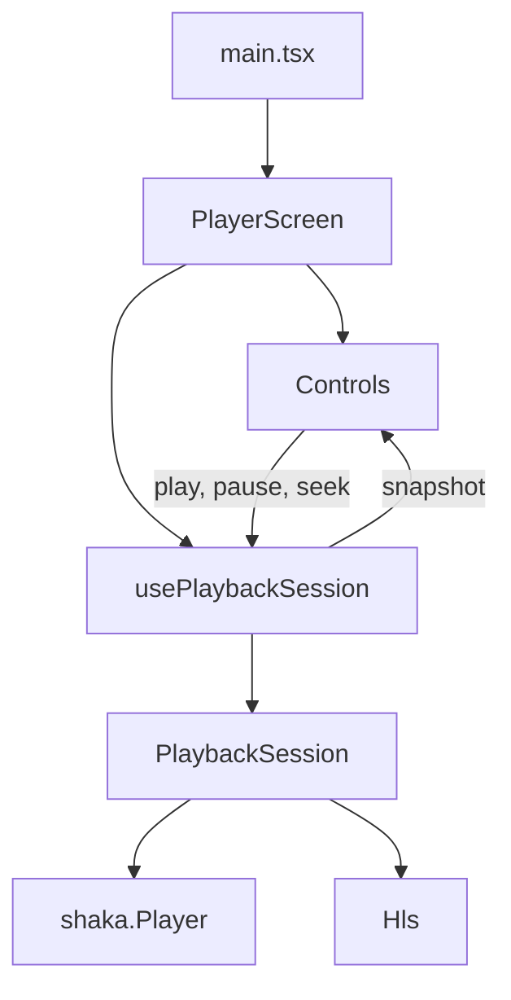

# Web

The web app plays protected `playpath-bars` with [Shaka Player](https://github.com/shaka-project/shaka-player), and clear HLS with [hls.js](https://github.com/video-dev/hls.js/). It is the encrypted DASH and HLS session, and the clear HLS session, for Chrome, Edge, and Firefox. Android and iOS are other apps.

Requires origin A, the license service, the clear package on `http://127.0.0.1:8084`, and Node 20.19 or newer. From `apps/web`:

```bash
npm install
npm run dev
```

Open `http://127.0.0.1:5173`. `localhost` is a different origin. Origin A and the license service allow only `http://127.0.0.1:5173`.

The page loads `http://127.0.0.1:8080/manifest.mpd` or `http://127.0.0.1:8080/master.m3u8` through Shaka. Play reaches a picture after Shaka’s Encrypted Media Extensions path posts to `http://127.0.0.1:8082/`. Clear HLS is `http://127.0.0.1:8084/master.m3u8`. Where `Hls.isSupported()` is true, that menu plays through hls.js and does not call the license service. On Safari 26.6.2 the same menu shows the color bars and the control reaches 1:00 / 1:00. The playlist request comes from the media element, and the license log has no request from that play. The page does not contain the content key. Play, pause, and seek go through `PlaybackSession`. Controls do not import Shaka or hls.js. When origin A returns 503 for a media segment, the next attempt requests that same path on `http://127.0.0.1:8081`. On Chrome, with `-refuse-segments`, protected DASH reached 0:25 and `1080p/seg_3.m4s` was 503 on origin A and 200 on origin B. The manifest and the init segments stayed on origin A. Stitched loads `http://127.0.0.1:8083/ssai/dash/manifest.mpd`. On Chrome that play shows the green pre-roll, then the color bars, at 0:10 / 1:05. The session logs both `ad` impressions and does not request the impression URL. With the ads service stopped, Stitched reaches 0:16 / 1:00 of color bars and the startup event names `http://127.0.0.1:8080/manifest.mpd`.

## Page structure

`PlayerScreen` and `Controls` are the React tree. The hook and `PlaybackSession` sit beside that tree. Shaka is not a component.



`main.tsx` finds `#root`, wraps `PlayerScreen` in `StrictMode`, and imports `player/player.css` once. It does not choose a menu or talk to Shaka.

`PlayerScreen` is the screen. It keeps the selected menu, protected DASH, protected HLS, or clear HLS, and the media element. The protected URLs come from `protectedMenus.ts`. The clear URL comes from `clearHlsMenu.ts`. It calls `usePlaybackSession` with that element and URL, then renders `Controls` with the snapshot and the three intents. The menu buttons live here. They are not a separate component.

`Controls` is the bar. It draws Pause when `playbackState` is `playing` or `seeking`, and Play when it is `paused` or `ended`. It also draws the seek range, the time label, the buffering label, and the error text. `--progress` is the only inline style. A click calls `onPlay`, `onPause`, or `onSeek`. While `adPlaying` is true the time label starts with Ad and the seek range is disabled, so a drag does not call `onSeek`. It does not import Shaka or hls.js, read a playlist, or call methods on the media element.

`usePlaybackSession` is the hook that connects React to the session. It creates one `PlaybackSession` in an effect, keeps that object in a ref, and stores the snapshot in state. Cleanup destroys that session immediately, including the extra mount from `StrictMode`. The next load waits for that destroy, not for a load that has not finished. `play`, `pause`, and `seek` forward to the session. The hook does not render.

`PlaybackSession` owns the engine. `chooseEngine.ts` sends a protected menu to Shaka. It sends clear HLS to hls.js on Chrome, Edge, and Firefox, and to the media element on Safari, including when hls.js also reports support. For Shaka it constructs `shaka.Player`, attaches it to the media element, points Clear Key at the URL from `drmServers.ts`, and loads the manifest. For a protected HLS playlist it runs `hlsClearKey.ts` on the response so Shaka can request a license from the lab server. For clear HLS on hls.js it constructs `Hls`, loads `http://127.0.0.1:8084/master.m3u8`, and attaches the element. On Safari, and on a browser that cannot run hls.js but can play HLS, the session sets that URL on the element and does not construct `Hls`. On Safari 26.6.2 that play shows the color bars and reaches the end of the title. The playlist request is `Sec-Fetch-Dest: video` and `Sec-Fetch-Mode: no-cors`, with no `Origin` header. A media error on that path sets the snapshot error, and the listener is removed with the session. Engine events become one snapshot: `playbackState`, `stalled`, `adPlaying`, `positionMs`, `durationMs`, `height`, `bandwidthBps`, and `error`. At the cue in `http://127.0.0.1:8083/vast/midroll.xml` the session pauses the film, plays that document’s creative on the same element, and ignores seek. When the creative ends, the session seeks the film back to that cue and clears `adPlaying`. The impression URL is not requested. The session logs `startup` when playback first starts and `ad` when the mid-roll starts and ends. A Shaka play also logs `drm`. hls.js does not. Safari's media element is not one of the schema engines, so that play does not log these events. On Chrome, clear HLS and protected DASH both show Ad, a disabled seek range, and then 0:10 / 1:00. A rung change logs `bitrate` with those height and bandwidth fields. On Chrome, one protected DASH session logged that change from `height` 720 and `bandwidthBps` 2164878 to `height` 1080 and `bandwidthBps` 4677870, with `startup`, `drm` with `result` `ok`, and the mid-roll `ad`. The picture was the color bars at 0:23 / 1:00. The class has no JSX. It does not read the content key, and it does not assign a bitrate. On Chrome, after hls.js has selected 1080p, restricting throughput moves clear HLS to 720p and the session logs `height` 720 and `bandwidthBps` 2157897. While the first segment is still arriving the bar says Buffering. At the end of the title the control reads 1:00 / 1:00.

`protectedMenus.ts` is the two origin A menu URLs. `clearHlsMenu.ts` is the clear master playlist. `drmServers.ts` is the `org.w3.clearkey` license URL. `hlsClearKey.ts` rewrites the lab HLS key-format line and builds init data from the key id already in that playlist. hls.js does not use that rewrite.

Shaka 5.2.12 does not parse the lab HLS key format. The session rewrites that playlist line to a key format Shaka does parse, maps it to `org.w3.clearkey`, and supplies a Clear Key init-data box built from the key id already in the playlist. The license request stays on the lab server.

On this page, a stopped license and a black picture are later observations. Android already shows that failure.

## Receiver page

`http://127.0.0.1:5173/receiver.html` is a second document on the same origin. It creates a media element and loads `http://127.0.0.1:8080/manifest.mpd` with Shaka. Clear Key uses the URL from `drmServers.ts`. Opening the page shows the color bars after that load and a post to the license service. The page does not contain the content key, does not import hls.js, and does not register a Cast, Tizen, or webOS receiver. Those certifications stay out of scope.
