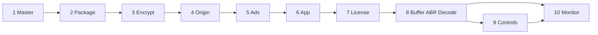
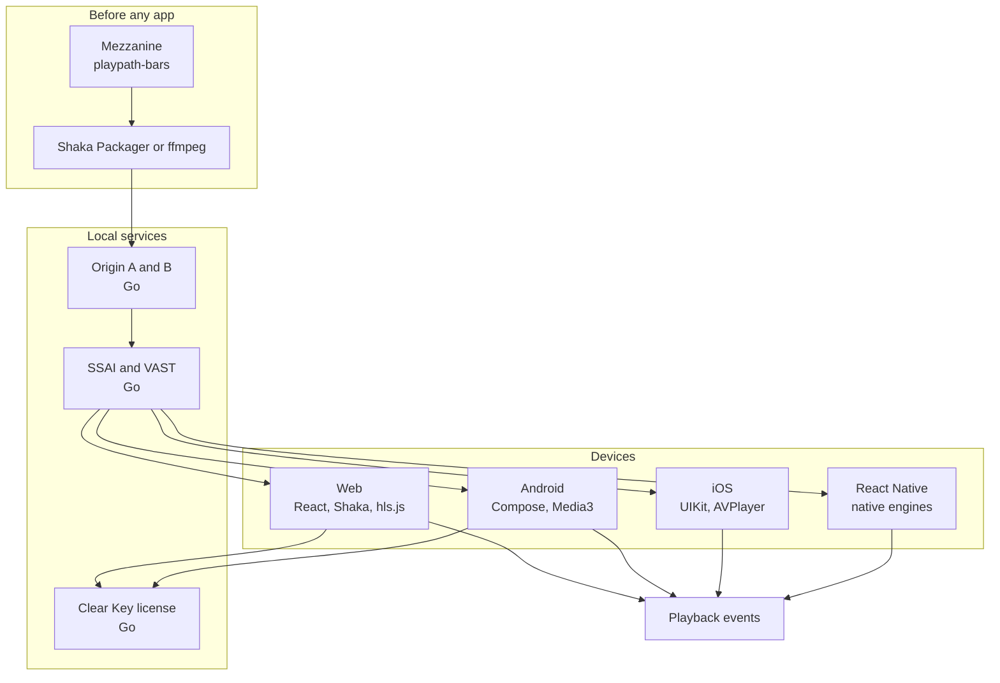
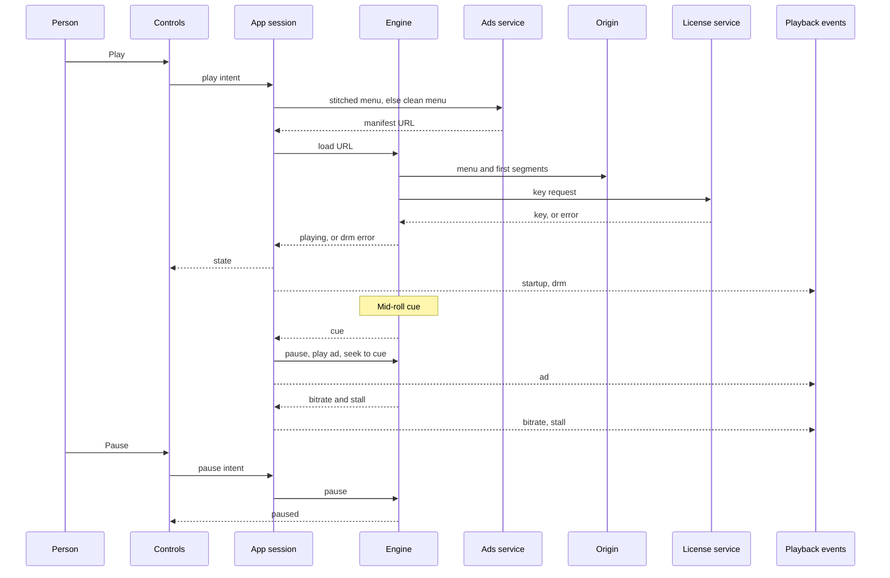
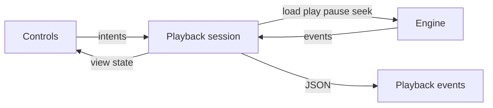

# Architecture

PlayPath is a lab for one streaming path. The title is prepared before any app runs. Each device then plays it with the engine that platform already has.

This document describes the path the PoC runs. The pipeline, both origins, the ads service, the Clear Key license service, and the web app are built. Android, iOS, and React Native are not, so nothing here claims those players are running. Week-by-week order is the [roadmap](roadmap.md). Choices are the [ADRs](architecture-decision-records.md). The proof for each box is a row in the [technical requirements](technical-requirements.md).

**How to read the diagrams.** Solid arrows are the happy path. The license step fails closed: no key, no picture. The ad stitcher fails open: no personalised menu, play the clean film.

## The ten phases

Phases 1 to 5 happen before a viewer exists. Phases 6 to 10 are the device.

| Phase | Name | Technology | Written in | Breaks when |
|---|---|---|---|---|
| 1 | Master | Mezzanine file | Media workflow | The source is wrong or missing |
| 2 | Package | HLS and DASH, one CMAF ladder | C++ packager, driven by a script or Go | A ladder or a menu is invalid |
| 3 | Encrypt | MPEG-CENC, Clear Key in the lab; FairPlay, Widevine, PlayReady in production | C++ packager, Go license service | The license service is down |
| 4 | CDN | HTTP segments, two local origins | Go | The segment host fails |
| 5 | Ads | SSAI and CSAI (VAST) | Go, then the app | A cue seeks to the wrong second |
| 6 | App | Compose, UIKit, React, engines | Kotlin, Swift, TypeScript | The wrong engine is used |
| 7 | License | EME or a native key session | Engine plus the platform CDM | The key never arrives |
| 8 | Playback | Buffer, ABR, decode | Engine plus platform decoders | The network drops and ABR does not |
| 9 | UI | Controls and theme | Kotlin, Swift, CSS, React Native styles | A control does not match player state |
| 10 | Monitor | Startup, stall, bitrate, ads, DRM | JSON from each app | One platform is invisible |



## 1. System context



iOS asks FairPlay in production. In this PoC it plays clear HLS and does not call the Clear Key service. That boundary is [ADR-003](architecture-decision-records.md).

## 2. What each phase owns

### Phase 1 — Master

The finished programme arrives as one file. It is not segmented, encrypted, or sized for a phone. Every later copy is derived from it. The apps never open it.

In this lab that file is a **mezzanine**, and the captions are a **WebVTT sidecar**.

A mezzanine is the intermediate master video file. It is not the camera original, and it is not the final delivery encode. Media workflows keep files in three rough tiers:

| Tier | What it is | Typical form |
|---|---|---|
| Acquisition | The highest-quality source | Camera raw, ProRes 4444, DPX |
| Mezzanine | A high-quality intermediate, and the source for every later transcode | ProRes 422 HQ, DNxHR HQX, or a high-bitrate H.264 or HEVC file |
| Distribution | The smaller files that are actually played | HLS and DASH renditions, progressive MP4s |

The mezzanine is good enough to derive web, broadcast, and social versions without going back to the original. `playpath-bars` has no camera original. Phase 1 writes a high-bitrate H.264 mezzanine, and every later encode is made from that file.

A sidecar is a companion file that travels with the media instead of being embedded in it. The WebVTT sidecar is a separate `.vtt` timed-text file for captions. It sits next to the mezzanine. It is not burned into the picture, and it is not muxed into the video. Players load it alongside the media.

`./pipeline/master.sh` writes those two files: `playpath-bars.mp4` and `playpath-bars.vtt`.

Output: the packager.

### Phase 2 — Package

The packager cuts the master into short segments and writes two menus that describe one timeline.

- **HLS.** Apple’s format. The menu is an `.m3u8` playlist. A master playlist lists the renditions. Safari, iOS, and tvOS play HLS natively.
- **DASH.** The MPEG menu is an `.mpd`. Android, Chrome, and most smart-TV stacks expect it.
- **CMAF.** One fragmented-MP4 ladder, two manifests. Packaging two independent encodes would double the files that can be wrong. Two menus exist because the devices disagree about the playlist format. See [ADR-002](architecture-decision-records.md).

`./pipeline/hls.sh` cuts the mezzanine into that ladder and writes the HLS menu under `pipeline/package/playpath-bars/`. `./pipeline/dash.sh` writes the DASH menu for those same segments. It does not encode again. `./pipeline/timelines.sh` compares segment times and the presentation duration across the two menus, and fails if they diverge. The segment duration is 6 seconds, from the [HLS Authoring Specification for Apple Devices](https://developer.apple.com/documentation/http-live-streaming/hls-authoring-specification-for-apple-devices) items 7.5 and 7.6, recorded in `pipeline/timeline`. The apps never do this work.

### Phase 3 — Encrypt

Segments are encrypted once with MPEG Common Encryption. A downloaded chunk is useless until a license step supplies the key, and the platform CDM decrypts in its own memory.

The lab key system is W3C Clear Key. Production devices do not share one DRM:

| System | Required on | Asked for by |
|---|---|---|
| FairPlay | Safari, iOS, tvOS | AVFoundation |
| Widevine | Chrome, Android, Android TV | EME, ExoPlayer / Media3 |
| PlayReady | Many smart TVs, Edge | EME |

Clear Key proves the encrypt-then-license shape on web and Android. It does not prove a production CDM. See [ADR-003](architecture-decision-records.md).

`./pipeline/encrypt.sh` reads the published lab key from `services/license/lab-key.json` and writes a protected copy at `pipeline/protected/playpath-bars/`. A failed encryption or timeline check removes the temporary copy and leaves an existing protected tree in place. The copy is the same CMAF timeline, with MPEG-CENC sample encryption. The HLS menu and the DASH menu name that key id and the Clear Key system `org.w3.clearkey`. Captions stay in the clear. The clear package under `pipeline/package/playpath-bars/` stays, because iOS and hls.js play clear HLS. The key bytes stay in the license config. Apps do not receive them. FairPlay, Widevine, and PlayReady stay named in the [engine map](engines.md) and are not reported as passing. They need vendor credentials. See [beyond-poc.md](beyond-poc.md).

### Phase 4 — CDN

Encrypted segments and both menus are files on an HTTP origin. The player requests a few seconds at a time. A failed chunk can be fetched again. A second origin is the resilience add-on. See [ADR-010](architecture-decision-records.md).

`go run ./services/origin` serves `pipeline/protected/playpath-bars/` on `http://127.0.0.1:8080`. The same command with `-addr 127.0.0.1:8081` serves that tree on origin B. A GET of a menu or segment returns a content type and `Last-Modified`. The process does not list directories, and it does not serve the content key or the mezzanine. A page on exactly `http://127.0.0.1:5173` can read menus and segments. Any other origin gets no `Access-Control-Allow-Origin`. Every response sends `Vary: Origin`. `OPTIONS` of a real file is 204. `OPTIONS` of `lab-key.json` or a missing path is 404. [`services/origin/session.json`](../services/origin/session.json) names the backup base URL. When origin A refuses a media segment, the same path is requested on origin B. Picture that continues, without restarting at the first segment, waits for an engine.

No app language owns this phase.

### Phase 5 — Ads

A break is either cut into the stream on the server, or played by the app as a second piece of media.

- **SSAI.** A Go service returns a menu in which the pre-roll is already part of the presentation. The player treats it as more of the stream. If that rewriter fails, the app loads the clean film.
- **CSAI.** The film menu stays intact. At 10 seconds the engine pauses, the app reads a VAST document, the engine plays the creative, then seeks back to that second.
- The app fires an impression for both, so a stitched ad is still counted.

`./pipeline/preroll.sh` writes a clear pre-roll of about 5 seconds and a progressive file of that creative. `go run ./services/ads` listens on `http://127.0.0.1:8083` only when those pre-roll paths are regular files, and returns one HLS menu and one DASH MPD. Each starts with that pre-roll and then the film. Film bytes stay on origin A. The clean menus stay at `http://127.0.0.1:8080/master.m3u8` and `http://127.0.0.1:8080/manifest.mpd`. The ads process answers 404 for those paths and for `duration.txt`, in any case, and does not redirect to them. [`services/ads/session.json`](../services/ads/session.json) names the clean menu when the stitched URL fails. That choice does not request an impression. `GET /vast/midroll.xml` is one linear creative, an impression URL, and a cue at 10 seconds into the film. On the web, on Android, and on iOS, the creative plays at 10 seconds and the film returns to that second. Picture of the stitched pre-roll, picture of the clean film after the stitcher stops, and the `ad` impressions, wait for an app.

### Phase 6 — The app and the engines

The app asks an engine to play a URL. The engine fetches the menu, chooses the bitrate, decrypts, decodes, and hands frames to the screen. The UI sends play, pause, and seek.

| Device | UI | Engine | Usual format in this lab |
|---|---|---|---|
| Android | Kotlin, Jetpack Compose | Media3 ExoPlayer | DASH |
| iOS | Swift, UIKit | AVFoundation `AVPlayer` | HLS |
| Chrome, Edge, Firefox | TypeScript, React | Shaka for DASH and for DRM; hls.js for clear HLS | DASH and HLS |
| Safari | TypeScript, React | Native HLS, or Shaka when the title is encrypted | HLS |
| React Native | TypeScript | The same Media3 and `AVPlayer` engines, behind a native view | The menu that engine plays |
| Chromecast, LG, Samsung web | JavaScript | A receiver page or the TV’s player | HLS or DASH |

Four engines means four failure modes. A bug in Media3 does not show up on iOS. That is why phase 10 uses one event shape.

`apps/web` is the Chrome, Edge, and Firefox row. `npm run dev` listens on `http://127.0.0.1:5173`. The session loads either protected menu with Shaka, and clear HLS with hls.js from `http://127.0.0.1:8084/master.m3u8`. Play, pause, and seek go through that session. Controls do not import Shaka or hls.js. Safari uses the element for clear HLS and does not construct hls.js, including when hls.js also reports support. On Safari 26.6.2 that play shows the color bars and the control reaches 1:00 / 1:00. The playlist request comes from the media element, and the license log has no request from it. `apps/android` is the Compose and Media3 row. It plays the encrypted DASH menu. `apps/ios` plays clear HLS with `AVPlayer`. The picture appears in UIKit, and that play does not call the license service. `http://127.0.0.1:5173/receiver.html` is the desktop receiver page. It loads the encrypted DASH manifest with Shaka. Chromecast, Tizen, and webOS certification stay out of scope.

### Phase 7 — License

Phase 3 locked the files in advance. Phase 7 is per viewer, per device, at the moment they press play. The same ciphertext serves everyone. The key is personal.

- Web: Shaka uses Encrypted Media Extensions. The JavaScript never holds the key. The CDM does.
- Android: Media3 opens a DRM session.
- iOS production: a content-key session on the asset. The PoC plays clear HLS and documents that session.

hls.js is the wrong place to hang DRM. A title that needs DASH plus a key system belongs in Shaka.

`go run ./services/license` listens on `http://127.0.0.1:8082`. `POST /` with the lab key id returns a Clear Key JSON Web Key set. An unknown key id gets a non-success status. The handler does not redirect to the clear package and does not log the key. A page on `http://127.0.0.1:5173` can read that response. The web session’s license call is the EME path Shaka drives, and the page does not read the key. The Android session opens a Media3 DRM session against the same URL. While the encrypted DASH menu plays, the license log shows `POST / 200` and the lab key id. A menu whose key id the service does not hold is `POST / 403`, the Compose picture stays black, and the session logs `drm` with `result: "error"`. The license service does not hand out the clear package instead. Stopping the license service, then playing that encrypted DASH menu, is a black picture and `drm` with `result: "error"` and `code: "ERROR_CODE_DRM_LICENSE_ACQUISITION_FAILED"`. The clear package is not requested.

### Phase 8 — Buffer, ABR, decode

The engine downloads the first segments, picks a bitrate, and steps down if the network slows. That switch is ABR. Decoders are platform code. The UI language receives events: playing, stalled, quality changed. On Chrome, clear HLS through hls.js, restricting throughput after 1080p is selected moves playback to 720p. The session logs `bitrate` with `height` 720 and `bandwidthBps` 2157897. The control does not assign that rung.

Retries are ordered: fetch the segment again, then step down a rung, then fail to the backup origin.

A stall is fixed here. A bad ad cut is fixed here when CSAI seeks to the wrong time, or in phase 5 when SSAI built the wrong menu.

### Phase 9 — Controls

The part a person sees and touches. Play, pause, seek, the title, and the layout. Product controls replace the engine’s default bar.

| Platform | Where styling is written |
|---|---|
| Android | Kotlin, in the Compose theme |
| iOS | Swift, on UIKit views |
| Web | CSS. TypeScript attaches the class |
| React Native | A style object in TypeScript |

You can redesign the screens without touching the packager. You cannot fix a stall by changing the layout. The control must mirror engine state. Rules: [ux-controls.md](ux-controls.md).

### Phase 10 — Monitor

Each engine reports the same facts, or an outage on one device stays invisible. The schema is [playback-events.md](playback-events.md). Kotlin, Swift, and TypeScript all emit it. One log is the audit trail. If a phase is not measured, it is not operated.

## 3. Press play

Phases 1 to 4 have already finished before this sequence. Phase 5 has either stitched a pre-roll or left the mid-roll cue in place.



## 4. Repository layout

The roadmap builds this tree. Today the repository contains `docs/`, this architecture, the root README, the MIT license, and the `pipeline/` commands. Those commands write the mezzanine, both menus, and the protected copy. The media files are build products and are not committed. `services/origin` is origin A and origin B. `services/ads` is the SSAI stitcher. `services/license` answers Clear Key and holds the published lab key. `apps/web` plays the protected menus with Shaka and clear HLS with hls.js. `apps/android` plays the encrypted DASH menu with Media3. `apps/ios` plays clear HLS with `AVPlayer`. `apps/mobile` is the React Native app. It has not been observed playing.

```
playpath-lab/
├── pipeline/                 # phases 1–3: mezzanine to encrypted CMAF
├── services/
│   ├── origin/               # phase 4, ports 8080 and 8081
│   ├── license/              # phases 3 and 7
│   └── ads/                  # phase 5, SSAI on port 8083
├── apps/
│   ├── web/                  # React, Shaka, hls.js
│   ├── android/              # Compose, Media3
│   ├── ios/                  # UIKit, AVPlayer
│   └── mobile/               # React Native
├── packages/
│   └── playback-events/      # phase 10 schema
├── docs/
├── LICENSE
└── README.md
```

## 5. Languages, and what they are not

| Language | Where it is written | Why it is there |
|---|---|---|
| TypeScript | Web, React Native, the event schema | Most screens. The authoring language for the browser and the shared mobile UI |
| JavaScript | Shaka, hls.js, the compiled web app, TV web runtimes | The web runtime. We depend on it even when we type TypeScript |
| Kotlin | Android | Compose and the Media3 configuration live here |
| Swift | iOS | UIKit and AVFoundation live here |
| Go | Origin, license, SSAI | Phases 4, 7, and 5. The license service fails closed |
| C++ | Packager, decoders, CDM | Not application code. Phases 2, 7, and 8 |
| Java | Inside Media3 | The engine’s history. The UI is Kotlin |
| Objective-C | Under AVFoundation | Apple’s older media API. Swift calls it |

None of the four app languages can replace the packager or the license service. Standards: [docs/README.md](README.md). Dependencies we call and do not restyle: [standards/dependencies.md](standards/dependencies.md).

## 6. What is resilient, and what is accepted

Solid, and in the PoC:

- Short segments, so a failed chunk is fetched again
- ABR, so the picture gets softer instead of stopping
- SSAI, so the pre-roll is one presentation
- A fallback from the stitched menu to the clean film
- A second origin, and a license process that can be restarted

Accepted, because the devices require it:

- One logical player, and a different engine on each platform
- DRM fails closed
- SSAI puts risk on the service that rewrites the playlist
- CSAI fails at the seam between film and ad
- Two menus, HLS and DASH, over one media ladder

The resilience is retries, a fallback stream, and more than one place to fetch segments and keys. It is not the number of engines.

## 7. Patterns

The structure follows the way each official player is meant to be embedded.

| Source | Pattern we follow |
|---|---|
| [Media3](https://developer.android.com/media/media3/exoplayer) | The app builds an `ExoPlayer`, passes a `MediaItem`, and listens. The player owns buffering, track selection, and DRM sessions |
| [AVFoundation](https://developer.apple.com/documentation/avfoundation/avplayer) | Swift holds an `AVPlayer`. The view observes `timeControlStatus` and `currentItem`. FairPlay, when added, is an `AVContentKeySession` on the asset |
| [Shaka Player](https://shaka-project.github.io/shaka-player/docs/api/tutorial-welcome.html) | The page owns a `shaka.Player`, calls `load`, and configures DRM servers. EME stays inside the browser |
| [hls.js](https://github.com/video-dev/hls.js/) | `Hls` attaches to a media element, reads the playlist, and appends buffers through Media Source Extensions |
| [React](https://react.dev/learn/thinking-in-react) and [Compose state](https://developer.android.com/develop/ui/compose/state) | UI state is a snapshot of engine events. Events go down. Intents go up |
| [Effective Go](https://go.dev/doc/effective_go) | Small services with explicit errors. The license handler returns an error status and stops |

Inside each app the session looks the same:



The session is the only type that talks to the engine. Controls never import Shaka, hls.js, Media3, or AVFoundation.

## 8. Glossary

| Term | Meaning |
|---|---|
| Mezzanine | The high-quality intermediate that later encodes are made from. Phase 1. Not the camera original, and not an HLS or DASH rendition. See [Phase 1](#phase-1--master) |
| Sidecar | A companion file that travels next to the media instead of being burned in or muxed. The captions are a WebVTT sidecar |
| WebVTT | Timed-text captions in a separate `.vtt` file |
| CMAF | One fragmented-MP4 media layout that both HLS and DASH can point at |
| ABR | Adaptive bitrate. The engine changes rung as throughput changes |
| EME | Encrypted Media Extensions. The browser API for a key request. The page does not receive the raw key |
| CDM | Content decryption module. Platform code that applies the key |
| Clear Key | The EME key system `org.w3.clearkey`, used here as the lab license |
| CENC | MPEG Common Encryption of the segments |
| SSAI | Server-side ad insertion. One menu contains the ad |
| CSAI | Client-side ad insertion. The app plays a second piece of media at a cue |
| VAST | The IAB document that describes that second piece of media |

## 9. Sources

- [HTTP Live Streaming](https://developer.apple.com/documentation/http-live-streaming)
- [HLS Authoring Specification for Apple Devices](https://developer.apple.com/documentation/http-live-streaming/hls-authoring-specification-for-apple-devices)
- [DASH Industry Forum guidelines](https://dashif.org/guidelines/)
- [W3C Media Source Extensions](https://www.w3.org/TR/media-source/)
- [W3C Encrypted Media Extensions](https://www.w3.org/TR/encrypted-media/)
- [FairPlay Streaming](https://developer.apple.com/streaming/fps/)
- [Android Media3 ExoPlayer](https://developer.android.com/media/media3/exoplayer) and [DRM](https://developer.android.com/media/media3/exoplayer/drm)
- [AVFoundation](https://developer.apple.com/documentation/avfoundation)
- [Shaka Player](https://shaka-project.github.io/shaka-player/docs/api/tutorial-welcome.html) and [Shaka Packager](https://github.com/shaka-project/shaka-packager)
- [hls.js](https://github.com/video-dev/hls.js/)
- [IAB VAST](https://iabtechlab.com/standards/vast/)
- [Jetpack Compose](https://developer.android.com/compose)
- [React](https://react.dev/)
- [React Native](https://reactnative.dev/)

## 10. Related docs

- [Happy path](happy-path.md)
- [Engines](engines.md)
- [Roadmap](roadmap.md)
- [Definition of Done](DoD.md)
- [Beyond the PoC](beyond-poc.md)
- [Playback events](playback-events.md)
- [Controls and UX](ux-controls.md)
